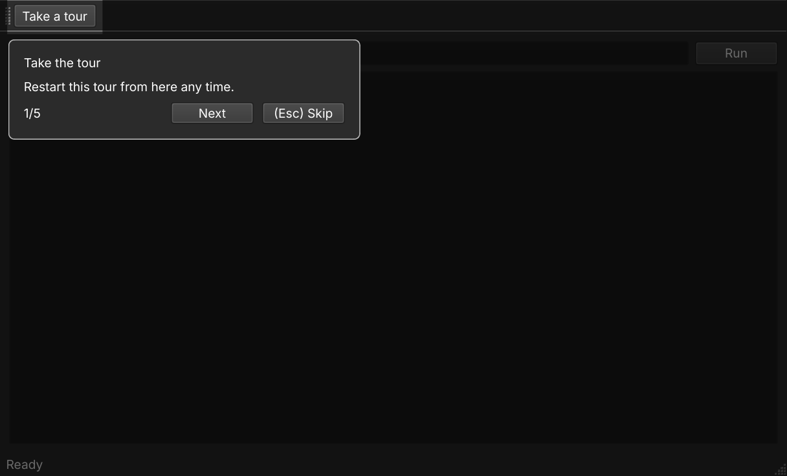

# qt-tour

[](https://pypi.org/project/qt-tour/)
[](https://pypi.org/project/qt-tour/)
[](LICENSE)

Small guided tours for Python Qt applications.



```python
from qt_tour import GuidedTour, TourAnchor, TourStep

GuidedTour(
    [
        TourStep(lambda: button, "Load data", "Load your dataset here."),
        TourStep(
            lambda: results_widget,
            "Results",
            "Results appear here.",
            anchor=TourAnchor.ABOVE,
        ),
    ],
    window,
).start()
```

## Install

```bash
uv add qt-tour
uv add PyQt6  # or PySide6
```

`qt-tour` depends on `qtpy`; you provide the Qt binding.

## Features

- ordinary `QWidget` targets
- lazy targets for widgets created later
- left, right, above, below, and center anchors
- overlay with target spotlight
- Previous / Next / Finish / Skip navigation
- Escape to close
- conditional steps with `skip`
- hidden-widget reveal hooks with `ensure_visible`
- `finished` signal

## Styling

Use Qt stylesheets:

```python
app.setStyleSheet("""
#qt_tour_tooltip { background: #2b2b2b; color: white; border-radius: 8px; }
#qt_tour_title { font-weight: bold; }
#qt_tour_counter { color: #aaa; }
""")
```

## Development

```bash
just help
just check
just docs-serve
```
